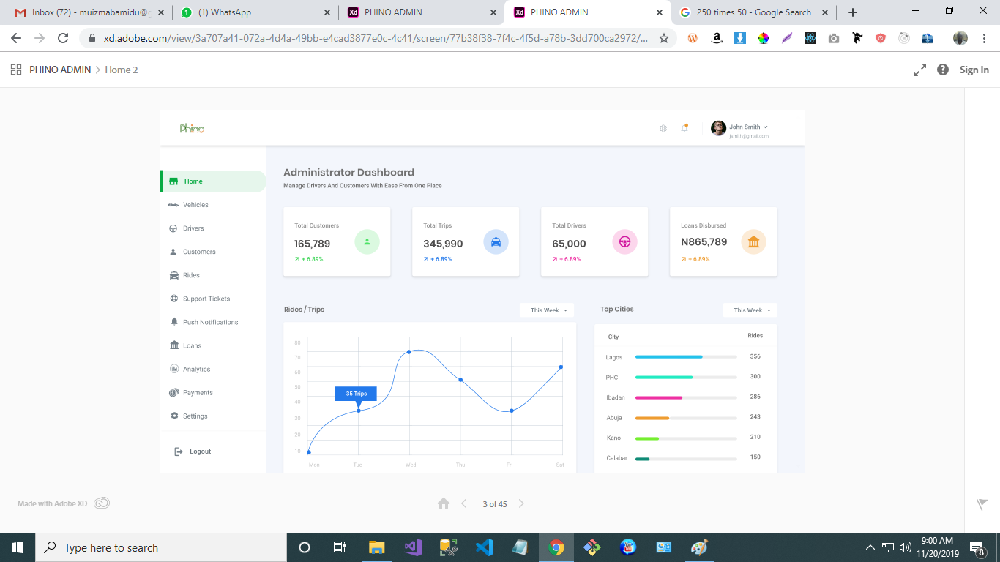

# Svelte Taxi App

Getting Started!
These instructions will get you a copy of the project up and running on your local machine for development and testing purposes. See deployment for notes on how to deploy the project on a live system.

Installing
Clone the Repository and run

npm install

npm start

Deployment
To deploy simply run

npm run build

Built With:

Reaact,
Redux,

Contributing
Please feel free to send pull request if you want to contribute!

Authors

Olawale Afuye
Setup
For Contributors, Fork the Repo, Clone and push to forked Repo.

![Maintenance Tracker WEBSITE](./designs/# Maintenance Reacker App

Getting Started!
These instructions will get you a copy of the project up and running on your local machine for development and testing purposes. See deployment for notes on how to deploy the project on a live system.

#### Installing
Clone the Repository and run

`npm install...`

`npm start...`

#### Deployment
`To deploy simply run...`

`npm run build...`

#### Built With:

`React...`
`Redux...`

Contributing
Please feel free to send pull request if you want to contribute!

Authors

Olawale Afuye
Setup
For Contributors, Fork the Repo, Clone and push to forked Repo.

